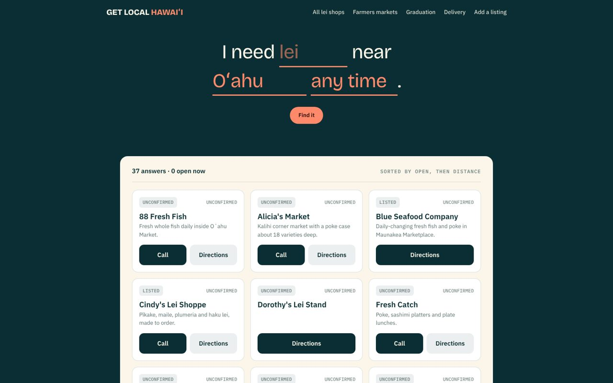

# Get Local Hawaiʻi

A trust-first directory of local Oʻahu vendors: lei stands, fish markets and farmers markets. Every listing shows when it was last verified, and "open now" is computed live, never hardcoded.

**Live: [getlocalhawaii.com](https://getlocalhawaii.com)**



- **Freshness first.** Each listing carries a verification log, and anything not confirmed in 30 days drops out of "open now" and shows as unconfirmed.
- **Farmers markets as a calendar.** Today's markets first, then the rest of the week, with real map pins from the City's own data.
- **Hawaiʻi time, always.** All open and closed math runs in `Pacific/Honolulu`.

Built with Next.js (App Router, TypeScript, Tailwind) on Supabase, deployed on Vercel.

```bash
npm run dev    # run locally
npm test       # unit tests
```

`docs/BUILD_SPEC.md` is the build spec and `docs/STATUS.md` the current state.

---

Built with ♥ by [shauna.digital](https://shauna.digital)
